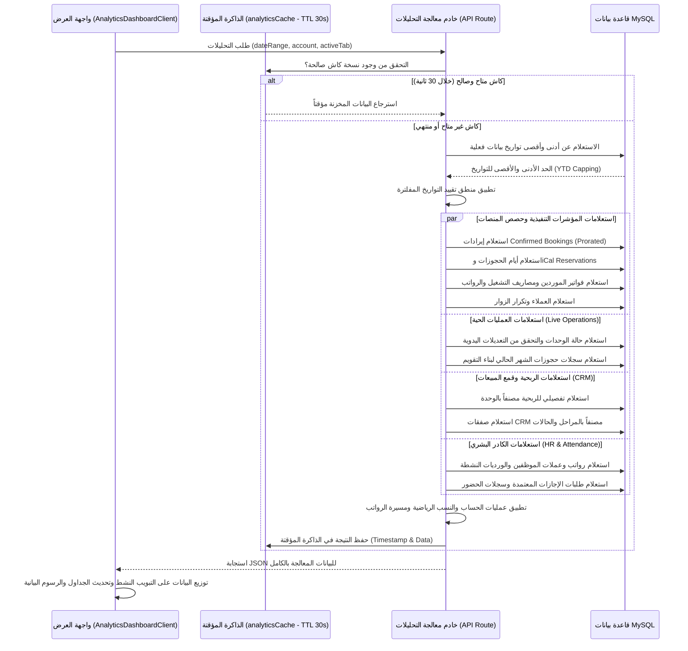
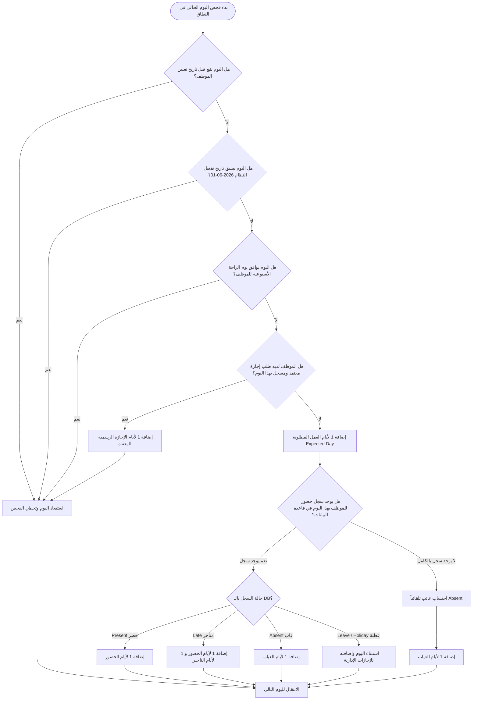

# الدليل التفصيلي الشامل لمنطق العمليات والحسابات في بوابة التحليلات المتقدمة (Advanced Analytics Portal)

يقدم هذا المستند دليلاً برمجياً وتشغيلياً تفصيلياً لكافة تبويبات بوابات التحليلات المتقدمة في نظام **NestedUnited ERP**، شارحاً الكيفية التي تترابط بها واجهات العرض الأمامية (`AnalyticsDashboardClient.tsx`) مع خادم معالجة البيانات الخلفي (`app/api/analytics/route.ts`) وقاعدة بيانات MySQL.

---

## المخطط الهيكلي وتدفق البيانات (Data Flow Architecture)

---

## البنية الأساسية للفلترة والتحكم بالشبكة (Global Control System)

تخضع كافة تبويبات التحليلات المتقدمة لفلترين رئيسيين يؤثران على طريقة استدعاء البيانات:
1. **فلترة النطاق الزمني (Date Ranges):**
   يدعم النظام فترات ديناميكية: اليوم (`today`)، الأسبوع الحالي (`week`)، الشهر الحالي (`month`)، ربع سنوي (`quarter`)، السنة الحالية (`year`)، كل الفترات (`all`)، وفترة مخصصة (`custom`).
2. **فلترة الحسابات العقارية (Account/Platform Account Filter):**
   عند تحديد حساب عقاري معين (`platform_account_id` من جدول `units`)، يقوم الخادم ببناء مصفوفة استبعاد برمجية تُطبّق على روابط الجداول (`INNER JOIN` أو `WHERE IN`) لضمان حصر التحليلات المالية والتشغيلية في الوحدات المملوكة لهذا الحساب فقط.
3. **آلية تقييد النطاق الفعلي وتجاوز الكاش (Bypass & Date Capping):**
   - **تقييد النطاق:** يُستعلم عن أقدم وأحدث تاريخ حجز بالـ DB، وتُجبر تواريخ الفلترة على ألا تتجاوز نطاق الحجوزات الفعلي لتفادي معالجة نطاقات زمنية خالية تماماً.
   - **تجاوز الكاش:** عند قيام المستخدم بتغيير التواريخ يدوياً، يمرر المتغير `bypassCacheRef.current = true` لتخطي الكاش وجلب بيانات طازجة فوراً.

---

## 1. التبويب الأول: ملخص الأداء التنفيذي الموحد (Executive Performance)

يهدف إلى تقديم كفاءة تشغيل الأصول العقارية والإيرادات الفعلية الموحدة وتطور النقدية.

### بطاقات المؤشرات الرئيسية الثمانية (The 8 KPI Cards):
1. **إجمالي الإيرادات (Total Revenue):**
   مجموع الإيراد اليومي الموزع تناسبياً على نطاق الفلترة للحجوزات المؤكدة فقط (`bookings` حيث `status = 'confirmed'`):
   $$\text{Daily Value} = \frac{\text{amount}}{\max(1, \text{checkout\_date} - \text{checkin\_date})}$$
   $$\text{Total Revenue} = \sum (\text{Daily Value} \times \text{Days in range})$$
2. **متوسط نسبة الإشغال (Occupancy Rate):**
   حجم مساحة الإشغال الفعلي للوحدات النشطة:
   $$\text{Occupancy Rate (\%)} = \left( \frac{\text{Manual Booked Days} + \text{iCal Reserved Days}}{\text{Active Units Count} \times \text{Days in Period}} \right) \times 100$$
3. **متوسط السعر اليومي (ADR):**
   متوسط القيمة التي يتم تحصيلها مقابل الليلة الواحدة المحجوزة يدوياً:
   $$\text{ADR} = \frac{\text{Total Revenue}}{\text{Manual Booked Days}}$$
4. **العائد لكل غرفة متاحة (RevPAR):**
   $$\text{RevPAR} = \text{ADR} \times \left( \frac{\text{Occupancy Rate}}{100} \right)$$
5. **إجمالي الحجوزات (Total Bookings):**
   مجموع عدد عمليات الحجز اليدوي والآلي المتداخلة مع الفلترة الزمنية.
6. **إجمالي المصروفات (Total Expenses):**
   حاصل جمع التكاليف التشغيلية (المقدرة بـ 0) + مصاريف الصيانة المحلولة (المقدرة بـ 0) + الرواتب الموزعة تناسبياً للشركة + فواتير الموردين المعتمدة تناسبياً بناءً على نسبة الوحدات المفلترة إلى إجمالي وحدات الشركة:
   $$\text{Allocated Payroll} = \frac{\text{Filtered Units}}{\text{Total Company Units}} \times \text{Prorated Payroll}$$
   $$\text{Allocated Invoices} = \frac{\text{Filtered Units}}{\text{Total Company Units}} \times \text{Vendor Bills in period}$$
7. **صافي الدخل (Net Income):**
   $$\text{Net Income} = \text{Total Revenue} - \text{Total Expenses}$$
8. **معدل الضيوف المتكررين (Repeat Guest Rate):**
   يقيس نسبة ولاء النزلاء عن طريق فلترة الحجوزات يدوياً وتجميعها حسب حقل معرف العميل (رقم الهاتف الموحد، أو الاسم عند انعدام الهاتف):
   $$\text{Repeat Guest Rate (\%)} = \left( \frac{\text{Count of unique guests with bookings} > 1}{\text{Total unique guests}} \right) \times 100$$

### الرسوم البيانية والتحليلات البصرية (Executive Charts):
- **تحليل الإيرادات والنمو الشهري:** رسم بياني مساحي (`AreaChart` باللون الأخضر `#10b981`) يوضح نمو الإيرادات المحققة في الأشهر الـ 12 المكونة للسنة المحددة.
- **توزيع الحصص السوقية للمنصات:** رسم بياني دائري مجوف (`PieChart` مجوف بقطر داخلي 52 وخارجي 70) مقسم كالتالي:
  - **Airbnb Global:** باللون الأحمر الداكن `#fd385b`.
  - **Gathern Local:** باللون البنفسجي/الموف `#8b5cf6`.
  - **حجز خارجي (Direct):** باللون الأخضر `#22c55e` (الإيرادات المتبقية بعد استقطاع المنصتين أعلاه).
- **أعلى الوحدات أداءً:** رسم بياني شريطي أفقي (`BarChart` أفقي باللون الأخضر) يظهر أفضل 5 شقق عقارية تحقيقاً للإيرادات المالية بالفترة.
- **نظرة عامة على العمليات الحية:** بطاقات ملخصة لحالة الشقق اليوم:
  - الشقق الجاهزة والشاغرة (`status === "شاغر وجاهز"`).
  - الشقق المأهولة بالنزلاء (`status === "مأهول"`).
  - الشقق قيد التنظيف والتحضير (`status === "تنظيف"`).
  - أعمال صيانة نشطة (`status === "تحت الصيانة"`).
- **مقارنة التدفق النقدي شهرياً:** رسم بياني للأعمدة المتجاورة (`BarChart` بعمودين) يقارن إجمالي الإيرادات (الأخضر) ومجموع المصاريف (الأحمر) لكل شهر.
- **منحنى مواسم نسب الإشغال الشهري:** رسم بياني مساحي أرجواني (`#8b5cf6`) يمثل النسبة المئوية للإشغال على مدار أشهر السنة لتحديد فترات الطلب الموسمية.
- **توزيع تذاكر الصيانة حسب الحالة:** رسم بياني دائري مجوف يمثل التذاكر (محلولة `#10b981` | قيد المعالجة `#f59e0b` | مفتوحة `#ef4444`).
- **أعلى الوحدات طلباً للصيانة:** رسم شريطي أفقي يوضح الوحدات الأكثر بلاغات صيانة، مع تلوين شريط الأداء بناءً على تكرار البلاغات (أحمر للوحدات المتهالكة التي بها $\ge 5$ بلاغات، برتقالي لـ $3-4$ بلاغات، أزرق للبلاغات المنخفضة $\le 2$).
- **تحليل الفواتير ومعدلات التحصيل:** رسم بياني شريطي بقيم فواتير المشتريات والمصروفات حسب الحالة في شجرة الحسابات (مؤكدة `#3b82f6` | ملغاة `#ef4444` | مدفوعة `#10b981` | مسودة `#64748b` | مرحلة `#8b5cf6`).

---

## 2. التبويب الثاني: العمليات التشغيلية والجاهزية (Live Operations & Readiness)

تبويب لمراقبة حالة الوحدات العقارية بشكل لحظي ومزامنتها تلقائياً مع جداول الحجوزات اليومية.

### نظام الفلترة اللحظي (Operational Live Filter):
يحتوي التبويب على 6 تصنيفات سريعة تتيح تصفية الشقق فورياً بالضغط عليها:
- **الكل:** يعرض كامل كادر الوحدات النشطة بالشركة.
- **الشغالة (المأهولة):** يفلتر الوحدات ذات الحالة ("مأهول" أو "إشغال" أو "لم يغادر").
- **نسبة الإشغال اللحظي:** يعرض نسبة الشقق المشغولة حالياً مئوياً.
- **شاغر وجاهز:** يفلتر الشقق النظيفة المستعدة للاستقبال ("شاغر وجاهز" أو "دخول اليوم" أو "خروج اليوم").
- **تحت التنظيف:** يفلتر الشقق التي تحتاج لخدمات التدبير المنزلي ("تنظيف").
- **بلاغات صيانة:** يفلتر الشقق التي يقع بها عطل معلق أو تم تعديل حالتها برمجياً إلى "تحت الصيانة".

### المنطق البرمجي لحالات الشقق (Dynamic Unit State Engine):
تُستخرج حالة الشقة بناءً على فحص شجري لجدول الحجوزات اليوم والمدخلات اليدوية للتشغيل:
1. **شاغر وجاهز (Ready):** هي الحالة الأساسية للوحدات النشطة الخالية من الحجوزات.
2. **دخول اليوم (Checkin Today):** إذا وجد حجز يبدأ اليوم للوحدة (`checkin_date = today` أو `start_date = today`).
3. **خروج اليوم (Checkout Today):** إذا وجد حجز ينتهي اليوم للوحدة (`checkout_date = today` أو `end_date = today`).
4. **مأهول (Occupied):** إذا كان تاريخ اليوم يقع في منتصف فترة حجز نشطة للوحدة.
5. **تنظيف وصيانة (Cleaning & Maintenance):**
   - إذا تم تحديث حالة الوحدة يدوياً من موظفي التشغيل إلى `"dirty"` أو `"awaiting_cleaning"` أو `"cleaning_in_progress"`، تظهر "تنظيف".
   - إذا تم تحديث الحالة يدوياً إلى `"maintenance"`، تظهر "تحت الصيانة".
   - **شرط استباقية الحجوزات:** في حال قيام الموظف بتعديل الحالة يدوياً، تُعتمد الحالة اليدوية ما لم يكن هناك تاريخ دخول حجز جديد لاحق لتاريخ تحديث الحالة اليدوي، فعندها تلغى الحالة اليدوية وتتحول تلقائياً إلى "دخول اليوم" أو "مأهول".

### التقويم المصغر لحجوزات الوحدة (Miniature Booking Calendar):
تقوم الواجهة ببناء تقويم شهري مصغر مدمج ببطاقة كل وحدة عقارية:
- يستخرج عدد أيام الشهر الحالي ونوع أيام الأسبوع لتحديد الإزاحة الافتراضية للبداية (`firstDayDate.getDay()`).
- يُجري خادم البيانات استعلاماً متقاطعاً لتواريخ الحجوزات وiCal للوحدة المحددة ويخزن الأيام المحجوزة في مصفوفة (`bookedDays`).
- يتم رسم خلايا التقويم (من 1 إلى نهاية الشهر)؛ وتظهر الأيام المحجوزة بخلفية خضراء مميزة (`bg-emerald-500` مع ظل بؤري)، وتظهر خلية اليوم الحالي محاطة بإطار أزرق (`ring-1 ring-blue-500`).

---

## 3. التبويب الثالث: جدول ربحية الوحدات العقارية (Unit Profitability)

تبويب مالي وتحليلي متقدم لتقييم أداء الشقق واستعراض أرقامها في جدول تفاعلي موحد.

### بطاقات التقييم الرائدة (Unit Insights Cards):
- **الوحدة الأعلى دخلاً:** الشقة الأكثر تسجيلاً لقيم الحجوزات الموزعة تناسبياً، وتظهر قيمتها ونسبة إشغالها الخاصة.
- **متوسط سعر الليلة (ADR):** حاصل جمع ADR للوحدات التي تحتوي حجوزات نشطة مقسوماً على عددها.
- **متوسط نسبة الإشغال للوحدات:** حاصل جمع نسب إشغال الوحدات مقسوماً على عددها الإجمالي.

### أعمدة جدول الربحية وهيكل الفرز (Interactive Profitability Grid):
يتم عرض البيانات داخل جدول غني يدعم البحث الفوري باسم الوحدة، ويسمح بالفرز التصاعدي والتنازلي عند الضغط على رؤوس الأعمدة التالية:
- **اسم الوحدة:** المعرف العقاري المسجل.
- **نسبة الإشغال:** نسبة الأيام المحجوزة للوحدة، مع تمثيل بصري كشريط تقدم مصغر باللون الأزرق السماوي (`bg-sky-500`).
- **سعر الليلة (ADR):** متوسط بيع الليلة للوحدة.
- **العائد المتاح (RevPAR):** كفاءة تشغيل أصول الوحدة.
- **إجمالي الإيراد:** حجم التدفقات المالية المدخلة للوحدة.
- **التكاليف التقديرية:** مجموع المصروفات التشغيلية الموزعة (تظهر باللون الأحمر `#f43f5e`).
- **صافي الأرباح:** الإيرادات بعد استقطاع المصاريف (تظهر باللون الأخضر المضيء `#10b981`).
- **هامش الربح:** يُحسب كنسبة مئوية:
  $$\text{Margin (\%)} = \left( \frac{\text{Net Profit}}{\text{Revenue}} \right) \times 100$$
  يظهر كبادج ملون (أخضر `bg-emerald-50` للهوامش المرتفعة $> 75\%$, وبرتقالي `bg-amber-50` للهوامش العادية).

---

## 4. التبويب الرابع: توقعات المبيعات وعلاقات العملاء (CRM & Sales Pipeline)

يحلل الكفاءة البيعية وقدرة فريق المبيعات على إتمام فرص التأجير والتعاقدات.

### المؤشرات الأربعة (CRM KPI Blocks):
1. **قيمة الفرص النشطة:** مجموع مبالغ الصفقات المستمرة في جدول `crm_deals` حيث الحالة `status = 'open'`.
2. **قيمة الصفقات المؤكدة:** مجموع مبالغ الصفقات التي تم إغلاقها بنجاح (`status = 'closed'` والمرحلة `completed` أو `management`).
3. **متوسط قيمة الصفقة:** القيمة المتوسطة للصفقات التي تحتوي مبالغ مسجلة أكبر من الصفر.
4. **معدل نجاح الصفقات:**
   $$\text{Conversion Rate (\%)} = \left( \frac{\text{Won deals count}}{\text{Won deals} + \text{Lost deals}} \right) \times 100$$

### تحليلات مراحل الصفقات وقمع المبيعات (Sales Funnel & Stage Analysis):
- **مخطط قمع المبيعات (Pipeline Funnel Chart):** شريط أفقي متدرج (`BarChart` متدرج الألوان) يقارن توزيع مبالغ الصفقات النشطة حسب المرحلة بتقدمها التشغيلي:
  - **مفاوضات وبانتظار الدفع (Negotiation):** باللون الأزرق (`#3b82f6`) - وزن التقدم: 30%.
  - **تم دفع عربون / دفعة جزئية (Partial Payment):** باللون البرتقالي (`#f59e0b`) - وزن التقدم: 60%.
  - **صفقات مكتملة ومؤكدة (Completed):** باللون الأخضر (`#10b981`) - وزن التقدم: 90%.
  - **تحت التشغيل والإدارة (Management):** باللون النيلي (`#6366f1`) - وزن التقدم: 100%.
- **توزيع صفقات CRM حسب الحالة:** رسم بياني دائري مجوف يمثل الصفقات المفتوحة والمغلقة والخاسرة، يتوسطه رقم كبير يمثل إجمالي الصفقات المعالجة بالفترة.
- **جدول الصفقات والفرص النشطة:** جدول بأحدث الصفقات يوضح اسم الفرصة، اسم العميل، القيمة المتوقعة، الأولوية (أحمر للمرتفعة، برتقالي للمتوسطة، أزرق للمنخفضة)، وتاريخ الإغلاق المتوقع.

---

## 5. التبويب الخامس: الموارد البشرية ومسيرة الرواتب (HR & Payroll)

يُدير تبويب الرواتب سجل موظفي الشركة، حضورهم، رواتبهم الموزعة تناسبياً، وتصاريح الإجازات المعتمدة.

### منطق حساب مسيرة الأجور والرواتب (Prorated Payroll Mechanics):
يسمح النظام بإدخال رواتب الموظفين بعملتي **الريال السعودي (SAR)** و**الجنيه المصري (EGP)**.

1. **حساب التناسب اليومي للموظفين الجدد (Prorated Logic):**
   إذا وقع تاريخ تعيين الموظف (`hire_date`) بعد تاريخ بداية الفلترة الزمنية، يتم تعديل معامل الاحتساب آلياً ليكون متوافقاً مع أيام عمله الفعلية داخل الفترة:
   $$\text{Worked Days} = \text{End Date} - \max(\text{Start Date}, \text{Hire Date}) + 1$$
   $$\text{Proration Factor} = \frac{\text{Worked Days}}{30}$$
   $$\text{Prorated Basic} = \text{Basic Salary} \times \text{Proration Factor}$$
   $$\text{Prorated Allowances} = (\text{Housing} + \text{Transport} + \text{Other}) \times \text{Proration Factor}$$
2. **الاستقطاع التقاعدي والضريبي الموحد (Deduction Calculation):**
   تُخصم نسبة تأمينية موحدة قدرها **2%** من الراتب الأساسي المعدل للفترة:
   $$\text{Deduction} = \text{Prorated Basic} \times 0.02$$
3. **صافي الراتب المستحق (Net Salary):**
   $$\text{Net Salary} = \text{Prorated Basic} + \text{Prorated Allowances} - \text{Deduction}$$
4. **سعر تحويل العملة الموحد للتقارير (SAR Conversion Rate):**
   لأغراض الميزانية الموحدة وعرض المخططات التنفيذية، تُحوّل الرواتب المصرية للريال السعودي بناءً على معامل التحويل الثابت:
   $$\text{1 EGP} = 0.0725 \text{ SAR} \quad (\text{أي } 1 \text{ SAR} \approx 13.80 \text{ EGP})$$

---

### منطق حساب حضور وانضباط الموظفين (Attendance System Engine):

يمتلك نظام الحضور دورة برمجة يومية متطورة للغاية (Day-by-Day Calendar Check loop) تفحص حضور كل موظف بدقة بالغة.

#### 1. حدود تاريخ بدء الحساب الفعلي (System Start Date Threshold):
تم وضع تاريخ بداية حرج وهو **1 يونيو 2026** (`2026-06-01`).
تُهمل كافة أيام الفلترة التي تسبق هذا التاريخ لتفادي احتساب غياب وهمي للموظفين قبل تفعيل النظام رسمياً.

#### 2. الدورة اليومية للحضور والانضباط (Day-by-Day Execution Loop):

#### 3. حساب النسب الإحصائية والأداء الحركي (Attendance Formulas):
- **نسبة الحضور للموظف (Attendance Rate):**
  $$\text{Attendance Rate (\%)} = \left( \frac{\text{Present Days} + \text{Late Days}}{\text{Expected Working Days}} \right) \times 100$$
- **نسبة الالتزام بالمواعيد (Punctuality Rate):**
  $$\text{Punctuality Rate (\%)} = \left( \frac{\text{Present Days}}{\text{Present Days} + \text{Late Days}} \right) \times 100$$

---

### معالجة عرض الحالات الاستثنائية والمستقبلية في الواجهة (UI Safety Checks):

تتضمن واجهة المستخدم معالجات بصرية دقيقة للتعامل مع الموظفين خارج فترة التتبع أو الفترات المستقبلية:
- **إرجاع مؤشر عدم التتبع:** إذا كان إجمالي أيام العمل المطلوبة للموظف في نطاق الفلترة المختار يساوي صفر (مثال: نطاق يقع بالكامل في المستقبل، أو قبل تعيين الموظف، أو قبل يونيو 2026)، يُرجِع الخادم القيمة `-1` لنسبة الحضور.
- **تأثير القيمة `-1` في الواجهة:**
  - يتم إخفاء شريط تقدم النسبة المئوية تفادياً للتشويه البصري.
  - يُعرض الرمز **`"—"`** بدلاً من نسبة `100%` أو `0%` المضللة.
  - يُكتب في عمود سجل الانضباط العبارة الواضحة: **"غير مشمول بالفترة"**.

---

### المخططات البيانية وسجلات الحضور والطلب في تبويب الموظفين:
- **توزيع الموظفين حسب المسمى الوظيفي:** شريط عمودي (`BarChart`) يُظهر توزيع تخصصات الموظفين (مترجمة برمجياً للغة العربية عبر دالة الترابط `translateJobTitle`). يعرض اللجند إجمالي عدد التخصصات والتخصص الأكثر انتشاراً بالشركة.
- **توزيع حالات الحضور المسجلة:** رسم دائري يوضح نسب السجلات الفعلية (حاضر `#10b981` | متأخر `#f59e0b` | غائب `#ef4444` | إجازة `#3b82f6`).
- **تحليل الانضباط العام:** بطاقة ذكية تولد نصائح وإرشادات ديناميكية للتشغيل والمدراء:
  - إذا كان معدل الحضور العام أقل من $80\%$، تظهر رسالة تحذيرية باللون الأحمر: *"تنبيه: هناك انخفاض ملحوظ في نسبة الحضور العام (غيابات متكررة)، يتطلب مراجعة من إدارة الموارد البشرية."*
  - إذا كان معدل الحضور جيداً ولكن الالتزام بالمواعيد دون تأخير يقل عن $80\%$، تظهر رسالة برتقالية: *"معدل الحضور العام ممتاز، ولكن يوصى بتنبيه الموظفين المتأخرين للالتزام بمواعيد العمل الرسمية."*
  - غير ذلك، يعرض نصيحة خضراء: *"مؤشرات الحضور والانضباط ممتازة جداً وتعكس بيئة عمل ملتزمة."*
- **جدول الرواتب والانضباط الموظفين التفصيلي:** قائمة بكافة موظفي الشركة تظهر الاسم، المسمى، نوع عملة القبض (ريال أو جنيه مع بادج مخصص)، الراتب والبدلات والاستقطاعات، وصافي الراتب الإجمالي.
- **سجل طلبات الإجازات والغياب الإداري:** جدول بطلبات الإجازة السنوية والمرضية وبدون راتب المقدمة، يوضح فتراتها وعدد أيامها وسببها وحالتها (معتمدة باللون الأخضر، معلقة بالأصفر مع وميض نابض `animate-pulse` لجذب الانتباه، أو مرفوضة بالأحمر).
